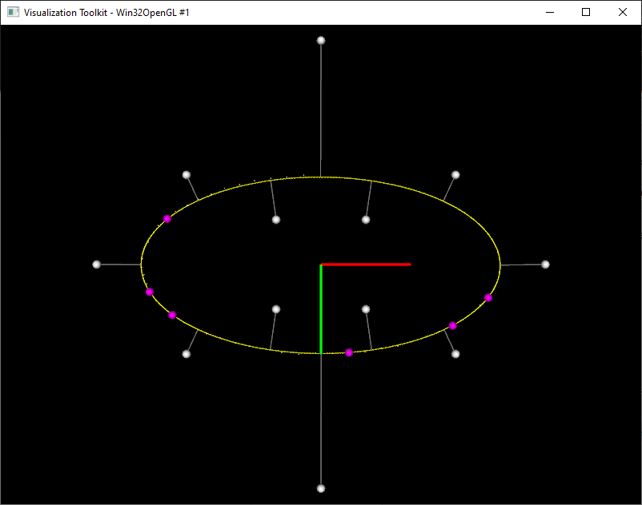
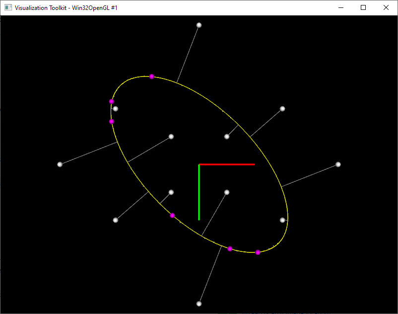
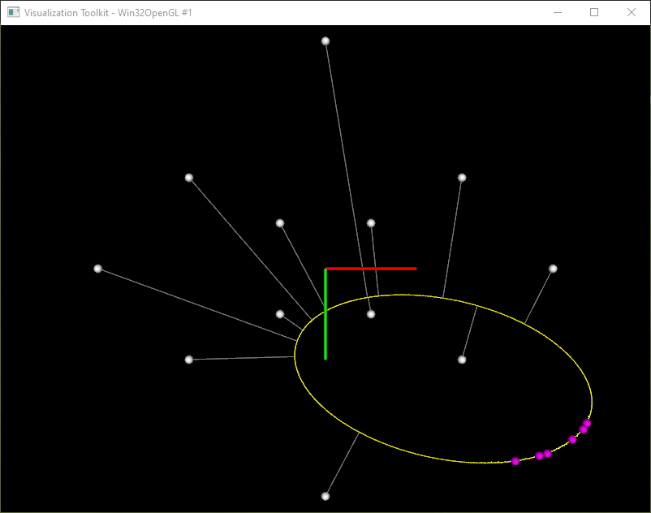

# Shortest distance from a point to a fitted ellipse

The following code presents the implementation of the "Direct Least Square Fitting of Ellipses" (Fitzgibbon *et al*., 1999) manuscript and the calculation of the minimal distance from a arbitrary points to the fitted ellipse.

## Requirements
Eigen 3.0.0\
PCL 1.11.0*

## Steps
1. Generate a set of elliptically placed and noisy target points.
2. Perform ellipse fitting \[1\] to obtain the respective ellipse parametric equation values.
3. Given an arbitrary point P, which shortest distance is to be evaluated, infer the ellipse quadrant it belongs to.
4. From that quadrant range, use a golden section line search \[2\] to find the ellipse point at the minimum distance from P.

## Results

<b>Fig. 1</b>: Shortest distances from arbitrary points (white) to an ellipse (yellow) fitted from 6 points (purple).

## References
![\[1\] Fitzgibbon A, Pilu M and Fisher RB (1999). *Direct least square fitting of ellipses*. IEEE Transactions on pattern analysis and machine intelligence, 21(5): 476-480.](https://ieeexplore.ieee.org/document/765658)\
![\[2\] Arora J (2012). *Introduction to optimum design*. Elsevier, 3rd ed, 425-430.](https://www.sciencedirect.com/book/9780123813756/introduction-to-optimum-design)\
\
(* https://github.com/PointCloudLibrary/pcl/issues/4734)